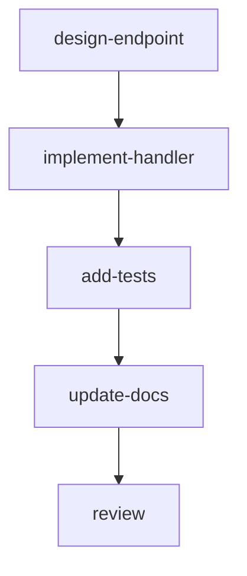

# PlanSpec Skill

Work orchestration using PlanSpec Goal, Plan, and Execution resources.

## Commands

| Command | Description | Server Required |
|---------|-------------|-----------------|
| `/planspec setup` | Install CLI, create dirs, set env vars | No |
| `/planspec validate [file]` | Validate resources offline | No |
| `/planspec server [start\|stop\|status]` | Manage `planspec serve` | N/A |
| `/planspec plan <task>` | Create Goal + Plan for a task | Yes |
| `/planspec convert [file]` | Convert markdown plan to PlanSpec | No (create), Yes (apply) |
| `/planspec implement <plan>` | Execute plan, tracking progress | Yes |
| `/planspec status [plan]` | Show execution status | Yes |
| `/planspec graph <plan>` | Visualize plan DAG | Yes |
| `/planspec watch [resource]` | Watch resource changes | Yes |
| `/planspec diff <file>` | Compare local file vs server | Yes |
| `/planspec edit <resource>` | Edit resource interactively | Yes |

## Configuration

PlanSpec CLI uses environment variables:

| Variable | Default | Description |
|----------|---------|-------------|
| `PLANSPEC_SERVER` | `http://localhost:8080` | API server URL |
| `PLANSPEC_NAMESPACE` | `default` | Default namespace |

Set these in your shell or use CLI flags:
```bash
export PLANSPEC_SERVER=http://localhost:8080
export PLANSPEC_NAMESPACE=myproject

# Or use flags
planspec get plans -n myproject --server http://localhost:8080
```

---

## /planspec setup

**Usage:** `/planspec setup`

Initialize PlanSpec for this project.

### Process

1. **Detect or install CLI**:
   ```bash
   # Check if planspec is available
   which planspec || echo "not found"
   ```

   If not found, offer options:
   - Install from crates.io: `cargo install planspec`
   - Clone and build: `git clone ... && cd planspec/cli && cargo build --release`
   - Use local path if in planspec repo

2. **Create directory structure**:
   ```bash
   mkdir -p planspec/{goals,plans,capabilities,bindings,gates,executions}
   ```

3. **Set environment variables**:
   Ask user for:
   - Server URL (default: http://localhost:8080)
   - Namespace (default: default)

   Suggest adding to shell profile:
   ```bash
   export PLANSPEC_SERVER=http://localhost:8080
   export PLANSPEC_NAMESPACE=default
   ```

4. **Create default capabilities** (optional):
   Ask if user wants to create standard capability definitions.

5. **Verify setup**:
   ```bash
   planspec --version
   curl -s http://localhost:8080/health  # Only if server running
   ```

---

## /planspec validate

**Usage:** `/planspec validate [file-or-directory]`

Validate PlanSpec resources against JSON schemas (works offline).

### Process

```bash
# Validate a single file
planspec validate -f planspec/goals/my-goal.yaml

# Validate a directory
planspec validate -d planspec/plans

# Validate recursively
planspec validate -d planspec -R
```

This command works without a server - it validates against embedded JSON schemas.

---

## /planspec server

**Usage:** `/planspec server [start|stop|status]`

Manage the PlanSpec server.

### Process

1. **For `start`**:
   ```bash
   # Check if already running
   curl -s http://localhost:8080/health && echo "Already running" && exit 0

   # Start server (runs in foreground by default)
   planspec serve --port 8080 --db planspec.db &

   # Wait for ready
   for i in {1..30}; do
     curl -s http://localhost:8080/health && break
     sleep 1
   done
   ```

2. **For `status`**:
   ```bash
   curl -s http://localhost:8080/health && echo "Running" || echo "Not running"
   ```

3. **For `stop`**:
   ```bash
   pkill -f "planspec serve"
   ```

### Server Options

```bash
planspec serve --help
# --host <HOST>    Host to bind (default: 127.0.0.1)
# --port <PORT>    Port to listen (default: 8080)
# --db <PATH>      SQLite database path
```

---

## /planspec plan

**Usage:** `/planspec plan <task description>`

Create a new Goal and Plan for a task.

### Prerequisites
- Server must be running: `curl -s $PLANSPEC_SERVER/health`

### Process

1. **Verify server is running**:
   ```bash
   curl -s ${PLANSPEC_SERVER:-http://localhost:8080}/health || {
     echo "Server not running. Use /planspec server start"
     exit 1
   }
   ```

2. **Analyze the task** - Understand what needs to be done

3. **Explore if needed** - Use Glob/Grep/Read to understand relevant code

4. **Ask clarifying questions** - Use AskUserQuestion for ambiguous requirements

5. **Generate Goal name** from task (lowercase, hyphenated)

6. **Create Goal file** at `planspec/goals/{name}.yaml`:
   ```yaml
   apiVersion: planspec.io/v1alpha1
   kind: Goal
   metadata:
     name: {name}
     namespace: {namespace}
   spec:
     description: "{task description}"
     acceptanceCriteria:
       - description: "{criterion 1}"
       - description: "{criterion 2}"
     priority: 100
   ```

7. **Create Plan file** at `planspec/plans/{name}-v1.yaml`:
   ```yaml
   apiVersion: planspec.io/v1alpha1
   kind: Plan
   metadata:
     name: {name}-v1
     namespace: {namespace}
     labels:
       planspec.io/goal: {name}
       planspec.io/series: {name}
       planspec.io/version: "1"
   spec:
     goalRef:
       name: {name}
     series: {name}
     version: "1"
     description: "Implementation plan for {task}"
     graph:
       nodes: [...]
       edges: [...]
   ```

8. **Create Gate resources** if plan has Gate nodes:
   ```yaml
   apiVersion: planspec.io/v1alpha1
   kind: Gate
   metadata:
     name: {plan-name}-review
     namespace: {namespace}
   spec:
     gateType: approval
     targetRef:
       kind: Plan
       name: {plan-name}
     description: "Review and approve implementation"
   ```

9. **Validate locally**:
   ```bash
   planspec validate -f planspec/goals/{name}.yaml
   planspec validate -f planspec/plans/{name}-v1.yaml
   ```

10. **Apply to server**:
    ```bash
    planspec apply -f planspec/goals/{name}.yaml
    planspec apply -f planspec/plans/{name}-v1.yaml
    ```

11. **Confirm creation**:
    ```bash
    planspec get goal {name} -n {namespace}
    planspec get plan {name}-v1 -n {namespace}
    ```

### Node Types

- **Task** - Work to be done
  - `capabilityRefs`: Array of capability references
  - `inputs`: Key-value input data
  - `outputs`: Array of output names
  - `acceptanceCriteria`: Verification criteria
  - `timeout`, `retries`, `when`

- **Gate** - Approval checkpoint (requires separate Gate resource)
  - `gateRef`: Reference to Gate resource
  ```yaml
  - id: review-gate
    kind: Gate
    description: "Human review and approval"
    gateRef:
      name: my-plan-review
  ```

- **External** - External system dependency
  - `externalRef`: Reference with type (uri, resource, webhook)
  ```yaml
  - id: ci-check
    kind: External
    description: "Wait for CI to pass"
    externalRef:
      type: uri
      uri: "https://ci.example.com/status"
  ```

- **Group** - Logical grouping of nodes
  - `children`: Array of node IDs
  - `mode`: "parallel" or "sequence" (hint only)

### Example Output
```
Created: planspec/goals/add-health-endpoint.yaml
Created: planspec/plans/add-health-endpoint-v1.yaml

Applied to server:
  Goal/add-health-endpoint created
  Plan/add-health-endpoint-v1 created

To implement: /planspec implement add-health-endpoint-v1
```

---

## /planspec convert

**Usage:** `/planspec convert [path-to-markdown-plan]`

Convert a markdown plan to PlanSpec resources.

### Process

1. **Read the markdown plan**:
   - If path provided, read that file
   - If no path, check `~/.claude/plans/` for recent plans
   - Ask user to select if multiple found

2. **Parse markdown structure**:
   - Title → Goal name
   - Objective section → Goal description
   - Requirements/Criteria → acceptanceCriteria
   - Steps/Implementation → Plan nodes
   - Dependencies mentioned → edges

3. **Generate Goal and Plan YAML**

4. **Validate locally**:
   ```bash
   planspec validate -f planspec/goals/{name}.yaml
   planspec validate -f planspec/plans/{name}-v1.yaml
   ```

5. **Apply to server** (if running)

6. **Report created resources**

### Markdown Patterns
```markdown
# Title                           → Goal name
## Objective                      → Goal description
## Acceptance Criteria            → acceptanceCriteria
- [ ] criterion                   → acceptanceCriteria item
## Steps / ## Implementation      → Plan nodes
### Step 1: Name                  → Node
- depends on Step N               → Edge
```

---

## /planspec implement

**Usage:** `/planspec implement <plan-name> [-n namespace]`

Execute a plan by working through its nodes.

### Prerequisites
- Server must be running
- Plan must exist in server

### Process

1. **Verify server**:
   ```bash
   curl -s ${PLANSPEC_SERVER:-http://localhost:8080}/health || {
     echo "Server not running. Use /planspec server start"
     exit 1
   }
   ```

2. **Load Plan from server**:
   ```bash
   planspec get plan $PLAN_NAME -n $NAMESPACE -o yaml
   ```

3. **Get Goal reference** from plan's `spec.goalRef`

4. **Find next execution number**:
   ```bash
   planspec get executions -n $NAMESPACE -o yaml | grep "name: $PLAN_NAME-exec" | wc -l
   ```

5. **Create Execution**:
   ```bash
   cat <<EOF | planspec apply -f -
   apiVersion: planspec.io/v1alpha1
   kind: Execution
   metadata:
     name: $PLAN_NAME-exec-$(printf "%03d" $NEXT_NUM)
     namespace: $NAMESPACE
   spec:
     goalRef:
       name: $GOAL_NAME
     planRef:
       name: $PLAN_NAME
   EOF
   ```

6. **Topologically sort nodes** by edges

7. **Create todos** from nodes in execution order using TodoWrite

8. **Execute each node**:

   For each node in order:

   a. Mark todo `in_progress`

   b. Read node's `context` for implementation guidance

   c. Perform the work:
      - **Task**: Do the work described, produce outputs
      - **Gate**: Pause, ask user for approval with AskUserQuestion
      - **External**: Check if dependency is satisfied

   d. Update execution status via API

   e. Mark todo `completed`

9. **Complete execution**

### Example Session
```
> /planspec implement add-health-endpoint-v1

Loading plan from server...
Plan: add-health-endpoint-v1 (5 nodes)
Goal: add-health-endpoint

Creating execution: add-health-endpoint-v1-exec-001

Execution order:
  1. [Task] design-endpoint
  2. [Task] implement-handler
  3. [Task] add-tests
  4. [Task] update-docs
  5. [Gate] review

Starting node 1/5: design-endpoint
  Context: Design a /health endpoint that returns...
  Working...
  ✓ Completed

Starting node 2/5: implement-handler
  ...
```

---

## /planspec status

**Usage:** `/planspec status [plan-name]`

Show execution status.

### Process

1. **Query executions**:
   ```bash
   # All executions
   planspec get executions -n $NAMESPACE

   # For specific plan
   planspec get executions -n $NAMESPACE | grep $PLAN_NAME
   ```

2. **Get detailed status**:
   ```bash
   planspec describe execution $EXEC_NAME -n $NAMESPACE
   ```

3. **Display progress**:
   ```
   Plan: add-health-endpoint-v1
   Execution: add-health-endpoint-v1-exec-001
   Phase: Running
   Progress: 3/5 nodes (60%)

   Nodes:
     ✓ design-endpoint      Completed
     ✓ implement-handler    Completed
     ✓ add-tests            Completed
     ○ update-docs          Pending
     ◇ review               Gate (waiting)
   ```

---

## /planspec graph

**Usage:** `/planspec graph <plan-name>`

Visualize a plan's dependency graph.

### Process

```bash
# Text format (default)
planspec graph $PLAN_NAME -n $NAMESPACE

# Mermaid diagram
planspec graph $PLAN_NAME -n $NAMESPACE --format mermaid

# Graphviz DOT
planspec graph $PLAN_NAME -n $NAMESPACE --format dot
```

### Example Output (Mermaid)


---

## /planspec watch

**Usage:** `/planspec watch <resource-type>`

Watch for resource changes in real-time.

### Process

```bash
# Watch all executions
planspec watch executions -n $NAMESPACE

# Watch with label selector
planspec watch executions -n $NAMESPACE -s "planspec.io/goal=my-goal"
```

### Resource Types
- `goals`
- `plans`
- `executions`
- `capabilities`
- `bindings`
- `gates`

---

## /planspec diff

**Usage:** `/planspec diff -f <file>`

Compare local file against server state.

### Process

```bash
planspec diff -f planspec/plans/my-plan-v1.yaml -n $NAMESPACE
```

Shows differences between local file and what's currently on the server.

---

## /planspec edit

**Usage:** `/planspec edit <resource-type> <name>`

Edit a resource interactively in your editor.

### Process

```bash
# Uses $EDITOR, $VISUAL, or vi
planspec edit plan my-plan-v1 -n $NAMESPACE
planspec edit goal my-goal -n $NAMESPACE
```

Opens the resource in your editor; applies changes on save.

---

## Capabilities Reference

Standard capabilities to reference in plan nodes:

| Capability | Use For |
|------------|---------|
| `code-generation` | Writing new code |
| `code-analysis` | Understanding existing code |
| `code-review` | Reviewing changes |
| `refactoring` | Restructuring code |
| `test-generation` | Writing tests |
| `test-execution` | Running tests |
| `documentation` | Writing docs |
| `research` | Investigating options |
| `planning` | Creating plans |
| `architecture` | Design decisions |

---

## Troubleshooting

### Server not running
```
Error: connection refused
```
Fix: `/planspec server start`

### CLI not found
```
Error: planspec command not found
```
Fix: `/planspec setup` to install

### Validation errors
```bash
# Check specific file
planspec validate -f path/to/file.yaml

# Validate all resources
planspec validate -d planspec -R
```

---

## Files

```
planspec/
├── goals/                  # Goal resources
├── plans/                  # Plan resources
├── capabilities/           # Capability definitions
├── bindings/              # Binding rules
├── gates/                 # Gate resources
└── executions/            # (optional) execution records
```
