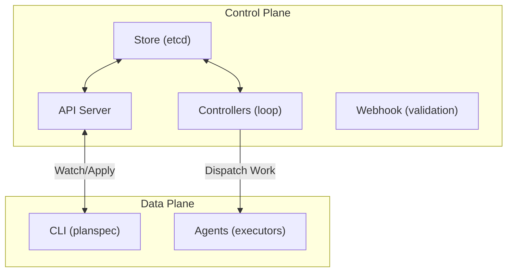
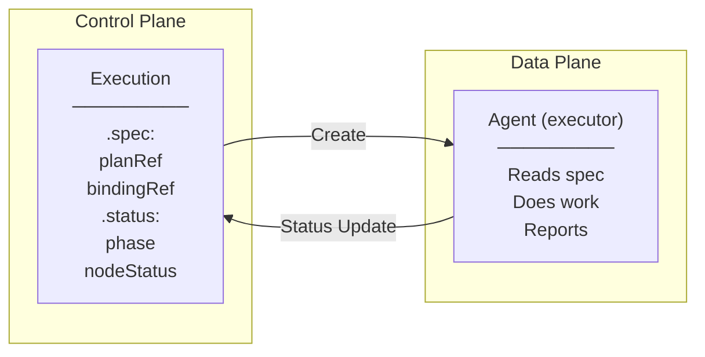
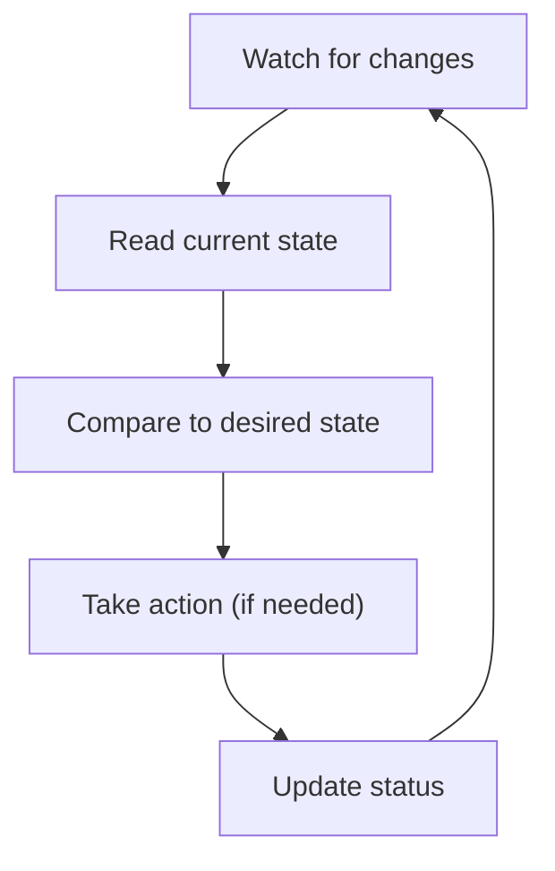
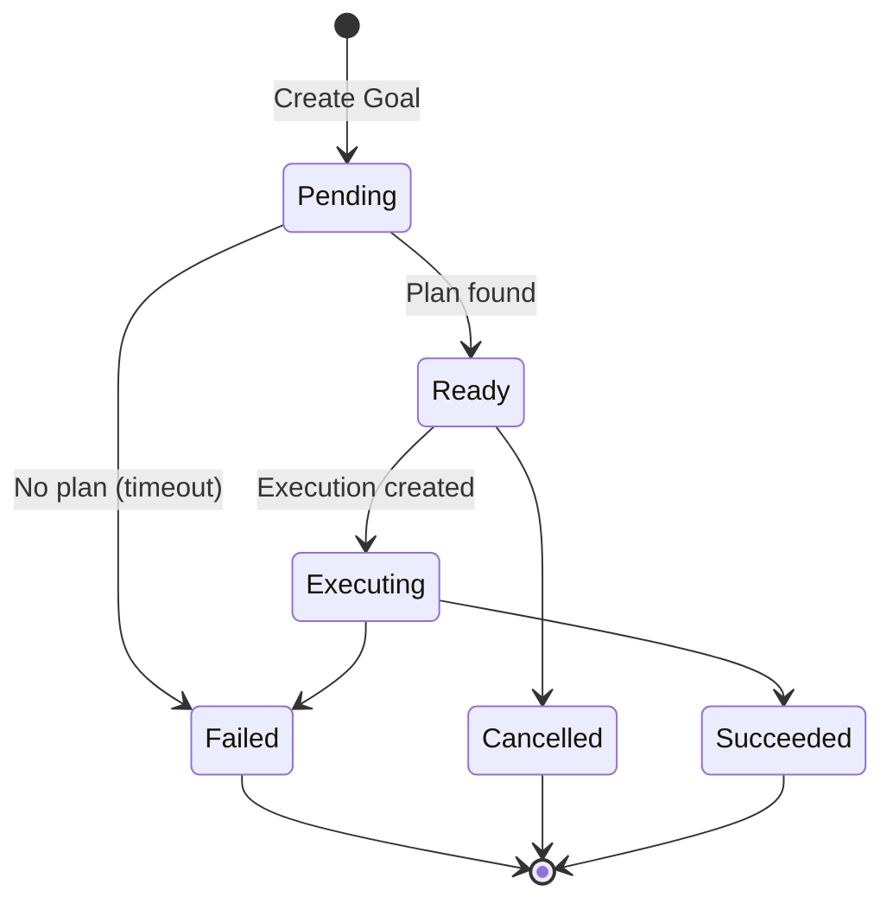
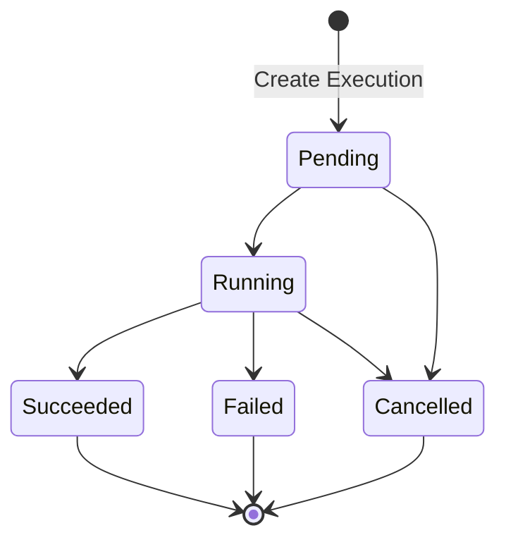
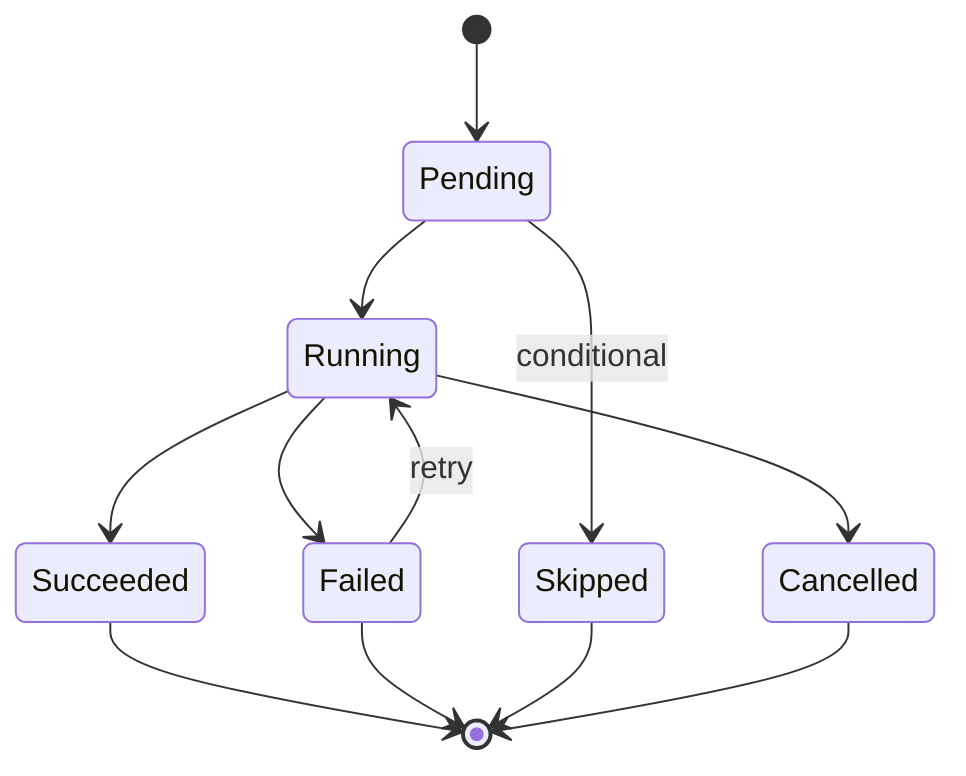
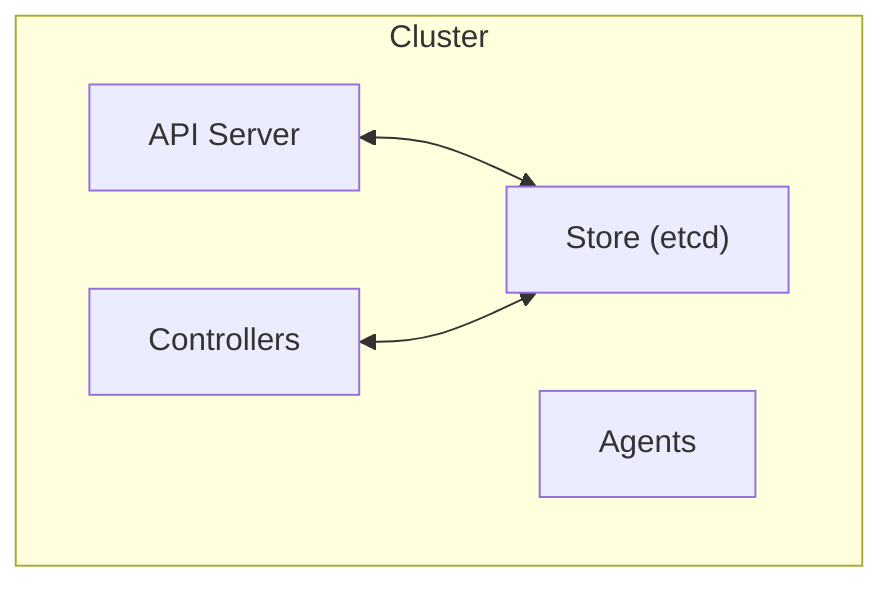
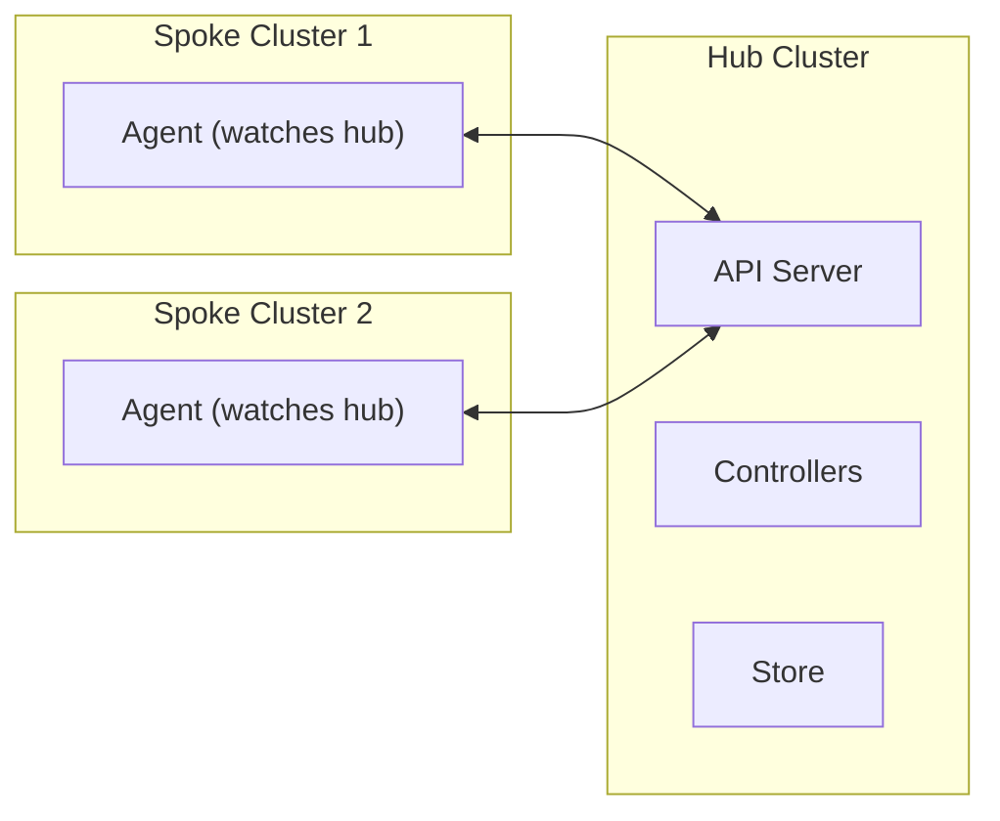

# PlanSpec Architecture

This document describes the system design, reconciliation model, and architectural principles of PlanSpec.

---

## Table of Contents

1. [Overview](#overview)
2. [Control Plane / Data Plane Separation](#control-plane--data-plane-separation)
3. [Reconciliation Model](#reconciliation-model)
4. [Controller Architecture](#controller-architecture)
5. [Resource Lifecycle](#resource-lifecycle)
6. [Versioning and Immutability](#versioning-and-immutability)
7. [Extension Points](#extension-points)
8. [Deployment Patterns](#deployment-patterns)

---

## Overview

PlanSpec follows the Kubernetes operator pattern: a declarative API where users express desired state, and controllers continuously reconcile actual state toward that desired state.



### Key Principles

1. **Declarative**: Users specify what, not how
2. **Eventually consistent**: Controllers drive toward desired state
3. **Idempotent**: Operations can be safely retried
4. **Observable**: Status reflects actual state
5. **Extensible**: Webhooks, custom controllers, custom providers

---

## Control Plane / Data Plane Separation

### Control Plane

The control plane manages resource definitions and orchestrates work:

| Component | Responsibility |
|-----------|----------------|
| **API Server** | CRUD operations, validation, authentication |
| **Store** | Persistent storage (etcd-compatible) |
| **Controllers** | Reconciliation loops for each resource type |
| **Webhooks** | Validation and mutation hooks |

The control plane is **stateless** (except for the store) and can be scaled horizontally.

### Data Plane

The data plane executes work:

| Component | Responsibility |
|-----------|----------------|
| **Agents** | Execute tasks, report status |
| **Providers** | Implement capabilities |
| **Runtimes** | Execution environments (sandboxes, containers) |

The data plane is **pluggable**—implementations can use any execution model.

### Boundary



The Execution resource is the handoff point:
- **spec** is immutable, set by control plane
- **status** is mutable, updated by data plane

---

## Reconciliation Model

PlanSpec uses the reconciliation pattern where controllers continuously compare desired state (spec) to actual state (status) and take corrective action.

### Reconciliation Loop



### Key Properties

1. **Level-triggered, not edge-triggered**: Controllers react to current state, not events
2. **Idempotent**: Running reconciliation twice produces the same result
3. **Optimistic concurrency**: Uses `resourceVersion` to detect conflicts
4. **Eventual consistency**: State converges over time

### observedGeneration Pattern

Controllers track which generation they've processed:

```yaml
metadata:
  generation: 5           # Incremented on spec change
status:
  observedGeneration: 5   # Controller has seen generation 5
  conditions:
    - type: Ready
      status: "True"
      observedGeneration: 5
```

This enables:
- Detecting stale status (observedGeneration < generation)
- Knowing when reconciliation is complete
- Debugging controller lag

---

## Controller Architecture

### Controller Types

| Controller | Watches | Manages |
|------------|---------|---------|
| **Goal Controller** | Goals | Goal.status, Plan selection |
| **Plan Controller** | Plans | Plan.status, graph validation |
| **Binding Controller** | Bindings, Plans | Binding.status, resolution |
| **Execution Controller** | Executions | Execution.status, node dispatch |
| **Capability Controller** | Capabilities | Capability.status |

### Goal Controller

```
Watch: Goals

For each Goal:
  1. If no activePlan and planSelector exists:
     - Find matching Plans
     - Select best match (version, labels)
     - Set status.activePlanRef
     - Transition to Ready

  2. If Ready and execution requested:
     - Create Execution
     - Transition to Executing

  3. If Executing:
     - Monitor Execution status
     - Transition to Succeeded/Failed when complete

  4. Update conditions throughout
```

### Plan Controller

```
Watch: Plans

For each Plan:
  1. Validate graph:
     - Check node ID uniqueness
     - Check edge references
     - Check for cycles

  2. Set status:
     - phase: Ready or Invalid
     - nodeCount: len(graph.nodes)

  3. Update conditions with validation errors
```

### Execution Controller

```
Watch: Executions

For each Execution:
  1. If Pending:
     - Resolve bindings
     - Generate runId
     - Set startTime
     - Transition to Running

  2. If Running:
     - Find ready nodes (dependencies met)
     - Dispatch to agents
     - Monitor node status
     - Handle retries

  3. When all nodes terminal:
     - Set completionTime
     - Transition to Succeeded/Failed

  4. Aggregate artifacts from nodes
```

### Work Dispatch

Controllers don't execute work directly. They:
1. Create/update resources (Executions, node statuses)
2. Agents watch for work and claim it
3. Agents report back via status updates

This decoupling enables:
- Multiple agent implementations
- Horizontal scaling of agents
- Different execution environments

---

## Resource Lifecycle

### Goal Lifecycle



### Execution Lifecycle



### Node Status Transitions

Within an Execution, each node follows:



---

## Versioning and Immutability

### What's Immutable

| Resource | Immutable Parts |
|----------|-----------------|
| All | `metadata.uid`, `metadata.creationTimestamp` |
| Execution | Entire `spec` after creation |
| Plan | Graph structure is versioned via new Plans |

### What's Mutable

| Resource | Mutable Parts |
|----------|---------------|
| All | `metadata.labels`, `metadata.annotations` |
| All | `status` (by controllers only) |
| Goal | `spec` (creates new generation) |
| Plan | `spec` (creates new generation, use series/version) |
| Binding | `spec.rules` (creates new generation) |

### Plan Versioning Strategy

Plans use explicit versioning instead of mutations:

```yaml
# Version 1
apiVersion: planspec.io/v1alpha1
kind: Plan
metadata:
  name: sso-implementation-v1
  labels:
    planspec.io/series: sso
    planspec.io/version: "1"
spec:
  series: sso
  version: "1"
  ...

# Version 2 (new resource)
apiVersion: planspec.io/v1alpha1
kind: Plan
metadata:
  name: sso-implementation-v2
  labels:
    planspec.io/series: sso
    planspec.io/version: "2"
spec:
  series: sso
  version: "2"
  supersedes:
    - name: sso-implementation-v1
  ...
```

Benefits:
- Full history preserved
- Can run old and new versions simultaneously
- Clear lineage via `supersedes`

### Optimistic Concurrency

All updates require `resourceVersion`:

```
1. Client reads resource (gets resourceVersion: "1234")
2. Client modifies and sends update (includes resourceVersion: "1234")
3. Server checks resourceVersion matches current
4. If match: update succeeds, new resourceVersion assigned
5. If mismatch: 409 Conflict, client must retry
```

---

## Extension Points

PlanSpec is designed to be extended without modifying core components.

### Webhooks

| Type | Purpose |
|------|---------|
| **Validating** | Reject invalid resources |
| **Mutating** | Set defaults, inject fields |

Example validating webhook:
- Reject Plans with cycles
- Enforce naming conventions
- Check capability exists before binding

### Custom Controllers

Build controllers for:
- Auto-generating Plans from Goals (planning agents)
- Auto-creating Bindings from conventions
- Custom scheduling logic
- Notifications and integrations

### Custom Providers

Providers implement capabilities:

```yaml
# Binding targets a provider
spec:
  rules:
    - selector:
        capabilityRef: { name: code-generation }
      target:
        provider: "agent://my-custom-agent"
        config:
          endpoint: "https://my-agent.example.com"
```

Provider URI schemes (implementation-defined):
- `agent://` — AI agent
- `service://` — Service endpoint
- `human://` — Human task queue
- `tool://` — CLI tool

### Annotations for Extensions

Use annotations for extension-specific data:

```yaml
metadata:
  annotations:
    # Planning system metadata
    planner.example.com/confidence: "0.85"
    planner.example.com/evidence: "similar-goal-123"

    # Execution hints
    scheduler.example.com/priority-class: "high"
    scheduler.example.com/node-affinity: "gpu"
```

---

## Deployment Patterns

### Single-Cluster

All components in one cluster:



### Multi-Cluster (Hub and Spoke)

Central control plane, distributed execution:



### Serverless / Embedded

PlanSpec as a library:

```go
// Embedded usage
store := memory.NewStore()
server := planspec.NewServer(store)

// Direct API calls
goal, _ := server.CreateGoal(ctx, goalSpec)
```

Useful for:
- Testing
- Single-process applications
- Edge deployments

---

## Summary

PlanSpec's architecture prioritizes:

1. **Simplicity**: Minimal core, extensible edges
2. **Reliability**: Reconciliation handles failures gracefully
3. **Scalability**: Stateless control plane, distributed data plane
4. **Flexibility**: Multiple deployment patterns, pluggable execution

The clear separation between control plane (what to do) and data plane (how to do it) enables diverse implementations while maintaining a consistent API contract.
