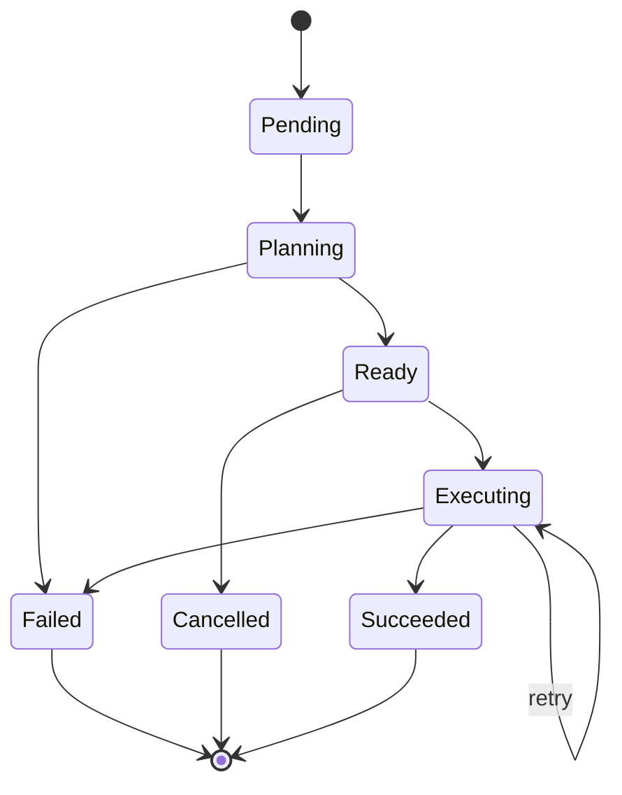
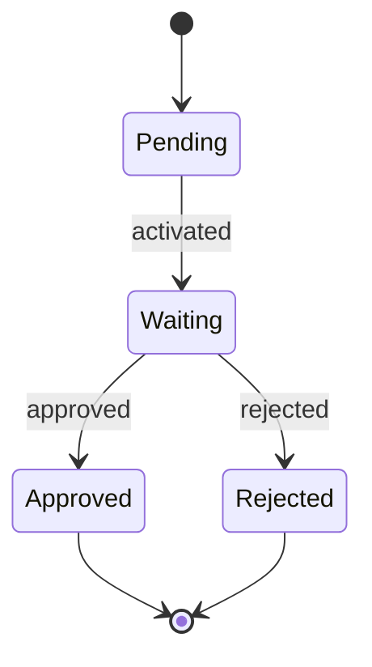

# PlanSpec Specification

**Version**: v1alpha1
**Status**: Draft

This document formally defines the primitives, semantics, and behaviors of PlanSpec using MUST/SHOULD/MAY language per RFC 2119.

---

## Table of Contents

1. [Common Structures](#common-structures)
2. [Goal](#goal)
3. [Plan](#plan)
4. [Capability](#capability)
5. [Binding](#binding)
6. [Execution](#execution)
7. [Gate](#gate)
8. [Context Attachments](#context-attachments)
9. [Graph Views](#graph-views)
10. [Deletion and Cleanup Semantics](#deletion-and-cleanup-semantics)
11. [Conventions](#conventions)

---

## Common Structures

### Resource Structure

All PlanSpec resources MUST follow the Kubernetes resource model:

```yaml
apiVersion: planspec.io/v1alpha1
kind: <ResourceKind>
metadata:
  name: <unique-name>
  namespace: <namespace>
  labels: {}
  annotations: {}
  uid: <system-generated>
  resourceVersion: <string>
  creationTimestamp: <datetime>
  generation: <integer>
  ownerReferences: []
spec:
  # Resource-specific specification
status:
  # Resource-specific status (controller-managed)
```

### ObjectMeta

| Field | Type | Required | Description |
|-------|------|----------|-------------|
| `name` | string | Yes | Unique within namespace, DNS label format (max 63 characters) |
| `namespace` | string | Yes | Isolation boundary |
| `uid` | string | System | Immutable server-assigned UUID |
| `resourceVersion` | string | System | Optimistic concurrency token |
| `generation` | integer | System | Increments on spec changes only |
| `labels` | map[string]string | No | Key-value pairs for selection |
| `annotations` | map[string]string | No | Key-value pairs for tooling (max 64KB per value) |
| `creationTimestamp` | datetime | System | RFC3339 timestamp |
| `deletionTimestamp` | datetime | System | Set when deletion requested (enables finalizers) |
| `deletionGracePeriodSeconds` | integer | System | Seconds until forced deletion |
| `finalizers` | []string | No | Unique list of finalizers that must complete before deletion |
| `ownerReferences` | []OwnerReference | No | For cascading deletion |

**Server-side field responsibilities:**

- Clients MUST NOT set `uid`, `resourceVersion`, `generation`, `creationTimestamp`
- Server MUST set these fields on create
- `generation` MUST increment only when `spec` changes (not on status updates)
- Controllers SHOULD set `status.observedGeneration` when they've reconciled a generation

### ObjectReference

All references use this shape to support cross-namespace reads and strong linking:

```yaml
name: <string>        # Required
namespace: <string>   # Optional, defaults to referring object's namespace
uid: <string>         # Optional, reserved - for strong references
```

- Cross-namespace references MAY be forbidden by policy in v1alpha1
- If `uid` is provided, servers MAY validate that the uid matches the resolved object

### OwnerReference

| Field | Type | Required | Description |
|-------|------|----------|-------------|
| `apiVersion` | string | Yes | API version of owner |
| `kind` | string | Yes | Kind of owner |
| `name` | string | Yes | Name of owner |
| `uid` | string | Yes | UID of owner |
| `controller` | boolean | No | If true, this is the managing controller |
| `blockOwnerDeletion` | boolean | No | Block owner deletion until this is deleted |

### Status (common pattern)

| Field | Type | Description |
|-------|------|-------------|
| `observedGeneration` | integer | Controller has reconciled this generation |
| `conditions` | []Condition | Standard conditions (Ready, Progressing, etc.) |
| `phase` | string | High-level lifecycle state |

### Condition

| Field | Type | Required | Description |
|-------|------|----------|-------------|
| `type` | string | Yes | "Ready", "Progressing", "Degraded", etc. |
| `status` | string | Yes | "True", "False", "Unknown" |
| `reason` | string | Yes | Machine-readable reason |
| `message` | string | No | Human-readable message |
| `lastTransitionTime` | datetime | Yes | When condition last changed |
| `observedGeneration` | integer | No | Generation when condition was set |

---

## Goal

A **Goal** represents a high-level objective to be achieved. Goals define the "what" and MAY be linked to one or more Plans that define the "how".

### Scope

**Namespaced**: Goals MUST be isolated within namespaces.

### Schema

```yaml
apiVersion: planspec.io/v1alpha1
kind: Goal
metadata:
  name: <goal-name>
  namespace: <namespace>
spec:
  description: <string>
  constraints: <map[string]any>
  acceptanceCriteria: <[]AcceptanceCriterion>
  planSelector: <LabelSelector>
  timeout: <duration>
  priority: <integer>
status:
  phase: <GoalPhase>
  activePlanRef: <ObjectReference>
  conditions: <[]Condition>
  observedGeneration: <integer>
```

### Spec Fields

| Field | Type | Required | Description |
|-------|------|----------|-------------|
| `description` | string | Yes | Human-readable description of the goal |
| `constraints` | map[string]any | No | Constraints that must be satisfied (e.g., technology choices) |
| `acceptanceCriteria` | []AcceptanceCriterion | No | Criteria that define when the goal is achieved |
| `planSelector` | LabelSelector | No | Select plans by labels |
| `timeout` | duration | No | Maximum time allowed (e.g., "24h", "168h") |
| `priority` | integer | No | Priority for scheduling (higher = more urgent). Default: 0 |

### AcceptanceCriterion

| Field | Type | Required | Description |
|-------|------|----------|-------------|
| `id` | string | No | Stable identifier (DNS label format) for referencing this criterion |
| `description` | string | Yes | Human-readable description of the criterion |

### LabelSelector

| Field | Type | Required | Description |
|-------|------|----------|-------------|
| `matchLabels` | map[string]string | No | Equality-based label matching |
| `matchExpressions` | []LabelSelectorRequirement | No | Set-based label matching |

### Status Fields

| Field | Type | Description |
|-------|------|-------------|
| `phase` | GoalPhase | Current lifecycle phase |
| `activePlanRef` | ObjectReference | Reference to the currently active Plan |
| `conditions` | []Condition | Detailed conditions |
| `observedGeneration` | integer | Generation observed by controller |

### GoalPhase

| Phase | Description |
|-------|-------------|
| `Pending` | Goal created, no plan selected |
| `Planning` | Plan is being generated |
| `Ready` | Plan exists, ready for execution |
| `Executing` | Execution in progress |
| `Succeeded` | All acceptance criteria met |
| `Failed` | Goal could not be achieved |
| `Cancelled` | Goal was cancelled |

Use conditions for nuance: `Planning`, `Blocked`, `AwaitingApproval`, etc.

### Lifecycle



---

## Plan

A **Plan** represents the "how" for achieving a Goal. Plans contain an embedded DAG of nodes and edges.

### Scope

**Namespaced**: Plans MUST be isolated within namespaces.

### Design Decision

**Plan is the durable artifact**—nodes are embedded in `Plan.spec.graph`, not separate CRUD resources. This avoids a "resource zoo" and keeps nodes as implementation details.

### Schema

```yaml
apiVersion: planspec.io/v1alpha1
kind: Plan
metadata:
  name: <plan-name>
  namespace: <namespace>
  labels:
    planspec.io/goal: <goal-name>
    planspec.io/series: <series>
    planspec.io/version: <version>
spec:
  goalRef: <ObjectReference>
  series: <string>
  version: <string>
  supersedes: <[]ObjectReference>
  description: <string>
  graph:
    nodes: <[]Node>
    edges: <[]Edge>
status:
  phase: <PlanPhase>
  nodeCount: <integer>
  conditions: <[]Condition>
  observedGeneration: <integer>
```

### Spec Fields

| Field | Type | Required | Description |
|-------|------|----------|-------------|
| `goalRef` | ObjectReference | No | Reference to the Goal (supports reusable plans) |
| `series` | string | No | Stable plan family identifier (requires `version`) |
| `version` | string | No | Version within series (requires `series`) |
| `supersedes` | []ObjectReference | No | Direct predecessor (max 1 for linear history) |
| `graphDigest` | string | No | Content hash of the graph (e.g., "sha256:abc123...") |
| `description` | string | Yes | Human-readable description |
| `graph` | Graph | Yes | The DAG structure |

**Why `goalRef` is optional:** Supports reusable plans and 1:many Goal-to-Plan relationships. A Plan may be used across multiple Goals or exist independently.

**Plan versioning fields:**
- `spec.series` — stable plan family identifier (e.g., "sso"). MUST be provided with `version`.
- `spec.version` — version within series (string). MUST be provided with `series`.
- `spec.supersedes` — direct predecessor only (max 1); full ancestry derived by traversal
- `spec.graphDigest` — SHA-256 hash of the graph for content-addressable caching

**Recommended labels (mirror spec fields for selectors):**
- `planspec.io/goal=<goalName>` — which goal this plan is for
- `planspec.io/series=<stable-id>` — mirrors `spec.series`
- `planspec.io/version=<version>` — mirrors `spec.version`

### Graph

| Field | Type | Required | Description |
|-------|------|----------|-------------|
| `nodes` | []Node | Yes | The nodes in the DAG |
| `edges` | []Edge | No | The edges connecting nodes (canonical dependency expression) |

**Dependencies:** Edges are the canonical way to express node dependencies. Node-local `dependsOn` is NOT supported; all dependencies MUST be expressed via the `edges` array.

### Node

Nodes have kind-specific constraints. All nodes share these common fields:

| Field | Type | Required | Description |
|-------|------|----------|-------------|
| `id` | string | Yes | Unique identifier within the plan |
| `kind` | NodeKind | Yes | Type of node |
| `description` | string | Yes | Human-readable description |
| `timeout` | duration | No | Maximum execution time |
| `when` | string | No | Condition expression for conditional execution |

### NodeKind

| Kind | Description |
|------|-------------|
| `Task` | A concrete unit of work to be executed |
| `Gate` | A checkpoint requiring approval or validation (requires `gateRef`) |
| `Group` | A container for sub-nodes (requires `children`) |
| `External` | Work performed outside PlanSpec (requires `externalRef`) |

### Task Node Fields

| Field | Type | Required | Description |
|-------|------|----------|-------------|
| `capabilityRefs` | []ObjectReference | No | Capabilities required to execute this task |
| `inputs` | map[string]any | No | Input values |
| `outputs` | []string | No | Expected output names (unique) |
| `acceptanceCriteria` | []AcceptanceCriteria | No | Machine-verifiable completion conditions |
| `retries` | integer | No | Number of retry attempts |

### Gate Node Fields

| Field | Type | Required | Description |
|-------|------|----------|-------------|
| `gateRef` | ObjectReference | **Yes** | Reference to Gate resource |

Gate nodes MUST specify a `gateRef`. Gate nodes MUST NOT have `capabilityRefs`, `inputs`, `outputs`, `retries`, `children`, or `externalRef`.

### Group Node Fields

| Field | Type | Required | Description |
|-------|------|----------|-------------|
| `children` | []string | **Yes** | Non-empty list of child node IDs |
| `mode` | GroupMode | No | Execution mode: "parallel" (default) or "sequence" |

Group nodes MUST have at least one child. Group nodes MUST NOT have `gateRef` or `externalRef`.

### GroupMode

| Mode | Description |
|------|-------------|
| `parallel` | Execute children concurrently (default) |
| `sequence` | Execute children in order |

### External Node Fields

| Field | Type | Required | Description |
|-------|------|----------|-------------|
| `externalRef` | ExternalRef | **Yes** | Reference to external work |
| `pollInterval` | duration | No | How often to poll for completion |

External nodes MUST specify an `externalRef`. External nodes MUST NOT have `gateRef` or `children`.

### ExternalRef

| Field | Type | Required | Description |
|-------|------|----------|-------------|
| `type` | string | Yes | Reference type: "uri", "resource", or "webhook" |
| `uri` | string | Conditional | URI for external system (required if type is "uri") |
| `resource` | ObjectReference | Conditional | Reference to external resource (required if type is "resource") |
| `webhook` | string | Conditional | Webhook URL (required if type is "webhook") |

### AcceptanceCriteria (for Task nodes)

Task nodes MAY specify machine-verifiable completion conditions via `acceptanceCriteria`. Each criterion has a `type` field that determines its structure.

| Type | Description |
|------|-------------|
| `artifact_exists` | Check file/path existence with optional content matching |
| `test_passes` | Run test commands and check exit codes |
| `endpoint_responds` | Validate HTTP endpoints (status, response patterns) |
| `command_succeeds` | Run arbitrary commands with expected exit codes |
| `custom` | External validation via webhooks |

**Common fields:**

| Field | Type | Required | Description |
|-------|------|----------|-------------|
| `type` | string | Yes | Criterion type |
| `name` | string | Yes | Human-readable name |
| `description` | string | No | Detailed description |
| `required` | boolean | No | If true, failure blocks completion. Default: true |

**Type-specific fields:**

- `artifact_exists`: `path` (required), `contentMatch` (optional regex)
- `test_passes`: `command` (required), `expectedExitCode` (default: 0)
- `endpoint_responds`: `url` (required), `method`, `expectedStatus`, `responseMatch`
- `command_succeeds`: `command` (required), `expectedExitCode` (default: 0)
- `custom`: `webhook` (required URL), `payload` (optional)

### Edge

| Field | Type | Required | Description |
|-------|------|----------|-------------|
| `from` | string | Yes | Source node ID |
| `to` | string | Yes | Target node ID |
| `type` | EdgeType | No | Type of dependency (defaults to hard in v0) |

### EdgeType (reserved for future)

| Type | Description |
|------|-------------|
| `hard` | Target cannot start until source succeeds (default in v0) |
| `soft` | Non-blocking dependency (future) |

### Graph Invariants

- Node IDs MUST be unique within a plan
- Edges MUST reference valid node IDs
- Graph MUST be acyclic considering all edges
- Validation MUST be performed at creation time; cyclic graphs MUST be rejected

### Status Fields

| Field | Type | Description |
|-------|------|-------------|
| `phase` | PlanPhase | Current phase |
| `nodeCount` | integer | Number of nodes in the graph |
| `conditions` | []Condition | Detailed conditions |
| `observedGeneration` | integer | Generation observed by controller |

### PlanPhase

| Phase | Description |
|-------|-------------|
| `Ready` | Plan is valid and ready for execution |
| `Invalid` | Plan has validation errors |

---

## Capability

A **Capability** represents a reusable ability that agents can provide. Capabilities are discovered and matched during binding resolution.

### Scope

**Namespaced**: Capabilities are scoped to namespaces. Teams iterate privately; future `CapabilityRelease` mechanism will enable publishing to a curated catalog.

### Schema

```yaml
apiVersion: planspec.io/v1alpha1
kind: Capability
metadata:
  name: <capability-name>
  namespace: <namespace>
spec:
  displayName: <string>
  description: <string>
  category: <string>
  inputs: <[]ParameterDefinition>
  outputs: <[]ParameterDefinition>
  requirements: <[]CapabilityRequirement>
status:
  phase: <CapabilityPhase>
  conditions: <[]Condition>
  observedGeneration: <integer>
```

### Spec Fields

| Field | Type | Required | Description |
|-------|------|----------|-------------|
| `displayName` | string | No | Human-friendly name |
| `description` | string | Yes | Description of what this capability does |
| `category` | string | No | Category for organization |
| `inputs` | []ParameterDefinition | No | Input parameters accepted |
| `outputs` | []ParameterDefinition | No | Output artifacts produced |
| `requirements` | []CapabilityRequirement | No | Other capabilities this one depends on |

### ParameterDefinition

| Field | Type | Required | Description |
|-------|------|----------|-------------|
| `name` | string | Yes | Parameter name |
| `type` | string | Yes | Data type: "string", "number", "boolean", "object", "array" |
| `description` | string | No | Description |
| `required` | boolean | No | Whether required. Default: false |
| `default` | any | No | Default value |

### CapabilityRequirement

| Field | Type | Required | Description |
|-------|------|----------|-------------|
| `capability` | string | Yes | Name of required capability |
| `optional` | boolean | No | Whether optional. Default: false |

### Status Fields

| Field | Type | Description |
|-------|------|-------------|
| `phase` | CapabilityPhase | Current phase |
| `conditions` | []Condition | Detailed conditions |
| `observedGeneration` | integer | Generation observed |

### CapabilityPhase

| Phase | Description |
|-------|-------------|
| `Available` | Capability is available for use |
| `Unavailable` | Capability is temporarily unavailable |
| `Deprecated` | Capability is deprecated |

### Composition Rules

1. Capabilities can declare dependencies on other capabilities via `requirements`
2. Circular dependencies are not allowed
3. Optional requirements are resolved if available but don't block execution
4. Capability names MUST be unique within a namespace

---

## Binding

A **Binding** resolves capability requirements to provider targets with support for defaults and overrides.

### Scope

**Namespaced**: Bindings are scoped to the namespace of the resources they serve.

### Schema

```yaml
apiVersion: planspec.io/v1alpha1
kind: Binding
metadata:
  name: <binding-name>
  namespace: <namespace>
spec:
  rules: <[]BindingRule>
status:
  phase: <BindingPhase>
  boundCount: <integer>
  unboundCapabilities: <[]string>
  conditions: <[]Condition>
  observedGeneration: <integer>
```

### Spec Fields

| Field | Type | Required | Description |
|-------|------|----------|-------------|
| `rules` | []BindingRule | Yes | Rules for resolving capabilities to providers |

### BindingRule

| Field | Type | Required | Description |
|-------|------|----------|-------------|
| `selector` | BindingSelector | Yes | What this rule matches |
| `target` | BindingTarget | Yes | The provider to use |

### BindingSelector

| Field | Type | Required | Description |
|-------|------|----------|-------------|
| `capabilityRef` | ObjectReference | No | Match all uses of a capability |
| `planRef` | ObjectReference | No | Match a specific plan |
| `nodeId` | string | No | Match a specific node (requires planRef) |

### BindingTarget

| Field | Type | Required | Description |
|-------|------|----------|-------------|
| `provider` | string | Yes | Implementation-defined string/URI |
| `config` | map[string]any | No | Provider-specific configuration |

### Binding Resolution Precedence

Resolution is deterministic with the following precedence (highest first):

| Precedence | Selector | Description |
|------------|----------|-------------|
| 1 (highest) | `planRef` + `nodeId` | Exact match to specific node |
| 2 | `capabilityRef` | Match all uses of a capability |
| (future) | Label selectors | Wildcard matching |

### Resolution Algorithm

1. Evaluate precedence levels in order (highest first)
2. Within a level, count matching rules:
   - 0 matches: continue to next level
   - 1 match: use it (done)
   - >1 matches: **Error** (conflict)
3. If no matches at any level: capability is unbound (may be error depending on requirements)

### Status Fields

| Field | Type | Description |
|-------|------|-------------|
| `phase` | BindingPhase | Current phase |
| `boundCount` | integer | Number of successfully bound capabilities |
| `unboundCapabilities` | []string | Capabilities that could not be resolved |
| `conditions` | []Condition | Detailed conditions |
| `observedGeneration` | integer | Generation observed |

### BindingPhase

| Phase | Description |
|-------|-------------|
| `Ready` | All capabilities are bound |
| `PartiallyBound` | Some capabilities are unbound |
| `Unresolved` | Critical capabilities are missing |

---

## Execution

An **Execution** represents the intent to run a Plan with specific bindings. Creating an Execution starts it immediately.

### Scope

**Namespaced**: Executions belong to the same namespace as their Plan.

### Design Decisions

- **Execution.spec is intent (immutable)**—cannot be modified after creation
- **Execution.status tracks runs (mutable)**—updated by controllers
- **Create = Start**—creating an Execution triggers it immediately (no separate `execute` verb in v0)

### Schema

```yaml
apiVersion: planspec.io/v1alpha1
kind: Execution
metadata:
  name: <execution-name>
  namespace: <namespace>
  ownerReferences:
    - apiVersion: planspec.io/v1alpha1
      kind: Goal
      name: <goal-name>
      uid: <goal-uid>
spec:
  goalRef: <ObjectReference>
  planRef: <ObjectReference>
  bindingRef: <ObjectReference>
  runtimeRef: <ObjectReference>
  parameters: <map[string]any>
status:
  phase: <ExecutionPhase>
  runId: <string>
  startTime: <datetime>
  completionTime: <datetime>
  nodeStatuses: <map[string]NodeStatus>
  artifacts: <[]Artifact>
  conditions: <[]Condition>
  observedGeneration: <integer>
```

### Spec Fields (Immutable Intent)

| Field | Type | Required | Description |
|-------|------|----------|-------------|
| `goalRef` | ObjectReference | No | Reference to the Goal |
| `planRef` | ObjectReference | Yes | Reference to the Plan to execute |
| `bindingRef` | ObjectReference | No | Reference to the Binding to use |
| `runtimeRef` | ObjectReference | No | Reserved—where/how execution runs |
| `parameters` | map[string]any | No | Execution parameters |

### Status Fields (Mutable)

| Field | Type | Description |
|-------|------|-------------|
| `phase` | ExecutionPhase | Current lifecycle phase |
| `runId` | string | Unique identifier for this run |
| `startTime` | datetime | When execution started |
| `completionTime` | datetime | When execution completed |
| `nodeStatuses` | map[string]NodeStatus | Status per node ID |
| `artifacts` | []Artifact | Artifacts produced |
| `conditions` | []Condition | Detailed conditions |
| `observedGeneration` | integer | Generation observed |

### NodeStatus

| Field | Type | Description |
|-------|------|-------------|
| `phase` | NodePhase | Current phase of the node |
| `startTime` | datetime | When node execution started |
| `completionTime` | datetime | When node execution completed |
| `attempt` | integer | Current attempt number |
| `outputs` | map[string]any | Outputs produced by the node |
| `message` | string | Human-readable status message |

### NodePhase

| Phase | Description |
|-------|-------------|
| `Pending` | Node waiting for dependencies |
| `Running` | Node is being executed |
| `Succeeded` | Node completed successfully |
| `Failed` | Node failed |
| `Skipped` | Node was skipped |
| `Cancelled` | Node was cancelled |

### ExecutionPhase

| Phase | Description |
|-------|-------------|
| `Pending` | Execution accepted, waiting for controller pickup |
| `Running` | Execution in progress |
| `Succeeded` | All nodes completed successfully |
| `Failed` | Execution failed |
| `Cancelled` | Execution was cancelled |

### Artifact

| Field | Type | Required | Description |
|-------|------|----------|-------------|
| `name` | string | Yes | Artifact name |
| `type` | string | Yes | Type (e.g., "file", "directory", "url") |
| `path` | string | No | Path to the artifact |
| `url` | string | No | URL to the artifact |
| `checksum` | string | No | Checksum for verification |
| `size` | integer | No | Size in bytes |
| `metadata` | map[string]string | No | Additional metadata |

### Trigger Semantics

- **v0**: `create` = start (no separate trigger action)
- `Pending` is the brief window between API acceptance and controller pickup
- No separate `execute` verb needed in v0
- **Future**: subresource `POST /executions/{name}/start` for explicit trigger if needed

---

## Gate

A **Gate** is an explicit approval checkpoint that blocks plan execution until approved or rejected. Gates provide auditable approval workflows and support future policy-based automation.

### Scope

**Namespaced**: Gates belong to the same namespace as the resources they gate.

### Design Decisions

- **Gates are standalone resources**—not embedded in Plans, enabling reuse and independent lifecycle/audit
- **`targetRef` is required**—every gate must specify what it's gating (prevents orphaned gates)
- **Resolution binds to spec generation**—`decidedGeneration` ensures approvals apply to a specific spec version
- **No timeout in v1alpha1**—gates block indefinitely until explicitly resolved
- **Language is "explicit approval" not "human-in-the-loop"**—supports future policy-based automation

### Schema

```yaml
apiVersion: planspec.io/v1alpha1
kind: Gate
metadata:
  name: <gate-name>
  namespace: <namespace>
spec:
  gateType: <GateType>
  targetRef: <TargetRef>
  description: <string>
  reviewers: <[]string>
  requiredApprovers: <integer>
  context: <map[string]any>
status:
  phase: <GatePhase>
  reviewHistory: <[]ReviewAction>
  resolution: <Resolution>
  decidedGeneration: <integer>
  conditions: <[]Condition>
  observedGeneration: <integer>
```

### Spec Fields

| Field | Type | Required | Description |
|-------|------|----------|-------------|
| `gateType` | GateType | Yes | Type of approval gate |
| `targetRef` | TargetRef | Yes | Reference to what this gate is gating |
| `description` | string | No | Human-readable description of what this gate approves |
| `reviewers` | []string | No | Authorized reviewers (users, teams, or service accounts) |
| `requiredApprovers` | integer | No | Number of distinct approvals required. Default: 1 |
| `context` | map[string]any | No | Arbitrary data to display to reviewers |

### GateType

| Type | Description |
|------|-------------|
| `approval` | Simple approval checkpoint |
| `review` | Code or design review |
| `sign-off` | Formal sign-off (e.g., for compliance) |

### TargetRef

Reference to what this gate is gating. Follows K8s ObjectReference conventions.

| Field | Type | Required | Description |
|-------|------|----------|-------------|
| `apiVersion` | string | No | API version of the target resource |
| `kind` | string | Yes | Kind of target (e.g., "Execution", "Plan") |
| `name` | string | Yes | Name of the target resource |
| `namespace` | string | No | Namespace (defaults to gate's namespace) |
| `uid` | string | No | UID for strong references (survives renames) |
| `nodeId` | string | No | Specific node within a Plan/Execution graph |

### Status Fields

| Field | Type | Description |
|-------|------|-------------|
| `phase` | GatePhase | Current lifecycle phase |
| `reviewHistory` | []ReviewAction | Audit trail of all review actions |
| `resolution` | Resolution | Final resolution details (required when terminal) |
| `decidedGeneration` | integer | Spec generation the resolution applies to |
| `conditions` | []Condition | Detailed conditions |
| `observedGeneration` | integer | Generation observed by controller |

### GatePhase

| Phase | Description |
|-------|-------------|
| `Pending` | Gate created but not yet activated by controller |
| `Waiting` | Active, awaiting resolution |
| `Approved` | Approved, execution can proceed |
| `Rejected` | Rejected, execution should fail/halt |

### ReviewAction

| Field | Type | Required | Description |
|-------|------|----------|-------------|
| `reviewer` | string | Yes | Identifier of the reviewer |
| `action` | string | Yes | Action taken: "approve", "reject", "comment" |
| `timestamp` | datetime | Yes | When the action was taken |
| `comment` | string | No | Comment explaining the action |
| `targetGeneration` | integer | No | Spec generation this action was taken against |

### Resolution

Required when phase is terminal (`Approved` or `Rejected`).

| Field | Type | Required | Description |
|-------|------|----------|-------------|
| `outcome` | string | Yes | Final outcome: "approved" or "rejected" |
| `actors` | []string | Yes | Reviewers who contributed to this outcome |
| `timestamp` | datetime | Yes | When resolution was finalized |
| `comment` | string | No | Summary comment for the resolution |

### Schema Invariants

The following invariants are enforced via JSON Schema `allOf`/`if-then` rules:

1. **`resolution` ⇔ `decidedGeneration`**: If either exists, both must exist
2. **Terminal phase requires resolution**: If `phase` is `Approved` or `Rejected`, `resolution` and `decidedGeneration` must be present
3. **Outcome matches phase**: `resolution.outcome = "approved"` ⇒ `phase = "Approved"` (and vice versa for rejected)

### Lifecycle



### Usage with Plans

Gates can be referenced from Plan nodes via `gateRef`:

```yaml
nodes:
  - id: approval-checkpoint
    kind: Gate
    description: "Requires approval before deployment"
    gateRef:
      name: production-deploy-gate
      namespace: default
```

When an Execution reaches a gate node, it transitions the Gate to `Waiting` and blocks until the Gate is `Approved` or `Rejected`.

---

## Context Attachments

PlanSpec resources MAY include contextual attachments for embedding notes, code pointers, and structured data. Context allows agents to "leave breadcrumbs" (design notes, snippets, links, decisions) without requiring a knowledge-graph implementation.

### Design Philosophy

**Context is for execution-local notes that travel with the plan.**

- Embed small markdown snippets that clarify intent
- Include code pointers (URIs) to relevant files
- Attach structured data (JSON) for machine consumption
- Keep heavy content (full design docs, long investigations) in external systems

PlanSpec allows attachments as opaque data; implementations decide how to index, rank, or use them.

### ContextItem Schema

```yaml
context:
  - name: <string>           # Optional identifier
    format: <ContextFormat>  # Required
    content: <string|object> # For markdown/text/json
    uris: <[]string>         # For uri-list
```

### ContextFormat

| Format | Content Type | Description |
|--------|--------------|-------------|
| `markdown` | string | Rich text with formatting |
| `text` | string | Plain text |
| `json` | object/array | Structured data |
| `uri-list` | (uses `uris`) | List of URI pointers |

### Field Constraints

- `format` is REQUIRED
- Either `content` or `uris` MUST be present (not both)
- For `markdown` and `text`: `content` MUST be a string
- For `json`: `content` MAY be any JSON value
- For `uri-list`: `uris` MUST be an array of URI strings; `content` MUST NOT be present
- `name` is OPTIONAL; useful for referencing specific context items

### Where Context Applies

| Resource | Field | Description |
|----------|-------|-------------|
| Goal | `spec.context[]` | Goal-level notes, constraints rationale |
| Plan | `spec.context[]` | Plan-level design notes, references |
| Plan Node | `spec.graph.nodes[].context[]` | Per-task implementation hints |
| Execution | `spec.context[]` | Runtime notes, execution-specific context |

### Examples

**Goal with design rationale:**

```yaml
spec:
  description: "Add logout functionality"
  context:
    - name: design-notes
      format: markdown
      content: |
        ### Constraints
        - Use existing session store (don't create new tables)
        - Clear cookies AND call server-side /api/logout
```

**Plan node with code pointers:**

```yaml
nodes:
  - id: implement
    kind: Task
    description: "Add logout button"
    context:
      - format: uri-list
        uris:
          - repo://src/components/UserProfile.tsx
          - repo://src/auth/session.ts
      - format: markdown
        content: |
          Use the existing `<Button />` component.
          Session clear is `auth.logout()`.
```

**Execution with runtime notes:**

```yaml
spec:
  planRef: { name: logout-v1 }
  context:
    - format: json
      content:
        incidentId: "INC-42"
        rationale: "Fixes stale token issue from incident"
```

### Security

- `context` is NOT for secrets
- Implementations MAY reject or scrub content matching secret patterns
- Reference secrets via URIs (`secret://...`) instead of embedding them

### Implementation Notes

- Size limits are implementation-defined
- Implementations MAY index context into a knowledge graph
- Implementations MAY redact context for compliance reasons
- Context SHOULD be preserved when copying or versioning resources

### What Belongs Where

**Embed in context:**
- Short rationale notes
- Code pointer lists
- Small markdown fragments clarifying intent
- Runtime notes (e.g., "flaky test; rerun with flag X")

**Keep in external systems (knowledge graph, docs):**
- Full PRDs and design docs
- Long investigations
- Meeting transcripts
- Large code excerpts
- Organization-wide guidance

The sweet spot is **embed pointers + short summary** in context, keep full content external.

---

## Graph Views

PlanSpec defines **executable resource specs** and their lifecycle semantics. Implementations may maintain additional internal indexes (including property graphs, search indexes, knowledge bases) to support planning, search, and explanation. Such indexes are **out of scope** for v1alpha1.

### Normative

1. Plan graphs are embedded DAGs and MUST be acyclic for execution ordering
2. Implementations MAY expose read-only "views" (like `/plans/{name}/graph`) derived from stored resources
3. Resources SHOULD be linkable and indexable via:
   - Stable identity (`uid`)
   - Labels/annotations for selection
   - References (`ObjectReference` with optional `uid`)

### Non-normative

- Implementations may build richer relationship graphs on top of PlanSpec resources
- Such graphs may include additional node/edge types, evidence, embeddings, etc.
- These are implementation details, not part of the PlanSpec contract

---

## Deletion and Cleanup Semantics

### Ownership Edges (recommended)

| Resource | Owner | Rationale |
|----------|-------|-----------|
| Execution | Goal | Deleting a goal cleans up its executions |
| Plan | (none) | Plans are reusable, survive goal deletion |

### Garbage Collection Behavior

- When a Goal is deleted, all Executions with `ownerReference` pointing to that Goal are deleted
- Plans are NOT owned by Goals by default (reusable across goals)
- To create a non-reusable plan, set `ownerReference` to the Goal explicitly

---

## Conventions

### Naming

- Resource names: lowercase, alphanumeric, hyphens allowed
- Pattern: `[a-z0-9]([-a-z0-9]*[a-z0-9])?`
- Max length: 63 characters (DNS label format)
- Namespaces follow the same rules

### Labels and Annotations

**Labels** are for selection and organization:
- Label keys follow Kubernetes label key syntax
- Label values MUST match: `^([A-Za-z0-9]([-A-Za-z0-9_.]*[A-Za-z0-9])?)?$` (max 63 chars, or empty)
- `planspec.io/goal` — Goal name
- `planspec.io/series` — Plan series identifier
- `planspec.io/version` — Plan version
- `planspec.io/team` — Team identifier
- `planspec.io/environment` — Environment (dev, staging, prod)

**Annotations** are for tooling and metadata (max 64KB per value):
- `planspec.io/created-by` — Identity of creator
- `planspec.io/description` — Extended description
- `planspec.io/source` — Source reference (e.g., git SHA)

### Durations

Durations use Go-style format: `1h30m`, `24h`, `168h`, `500ms`

Valid units: `ns`, `us` (or `µs`), `ms`, `s`, `m`, `h`. Days are NOT supported; use hours instead (e.g., `168h` for 7 days).

### References

Object references use:

```yaml
name: <name>          # Required
namespace: <namespace> # Optional, defaults to referring object's namespace
uid: <uid>            # Optional, for strict matching
```

### Versioning

- `apiVersion` is immutable per resource instance
- Controllers handle conversion between API versions
- Stored version may differ from requested version

---

## Authorization Model (Optional Conformance Profile)

RBAC is an **optional conformance profile**: `planspec-rbac`

### Core Verbs

`get`, `list`, `watch`, `create`, `update`, `delete`

### Extended Verbs (future)

`approve`

### Example Role

```yaml
apiVersion: planspec.io/v1alpha1
kind: Role
metadata:
  name: plan-editor
  namespace: team-platform
rules:
  - resources: ["goals", "plans", "bindings"]
    verbs: ["get", "list", "watch", "create", "update", "delete"]
  - resources: ["executions"]
    verbs: ["get", "list", "watch", "create"]  # create = start in v0
  - resources: ["capabilities"]
    verbs: ["get", "list", "watch"]
```

### RBAC Resources

**Role** (Namespaced): Defines permissions within a namespace.

**ClusterRole** (Cluster-scoped): Defines cluster-wide permissions.

**RoleBinding** (Namespaced): Binds a Role or ClusterRole to subjects.

**ClusterRoleBinding** (Cluster-scoped): Binds a ClusterRole cluster-wide.

### PolicyRule Fields

| Field | Type | Required | Description |
|-------|------|----------|-------------|
| `resources` | []string | Yes | Resources this rule applies to |
| `verbs` | []string | Yes | Allowed actions |
| `resourceNames` | []string | No | Specific names (empty = all) |

### Subject Kinds

| Kind | Description |
|------|-------------|
| `User` | A user identity |
| `Group` | A group of users |
| `ServiceAccount` | A service account |
